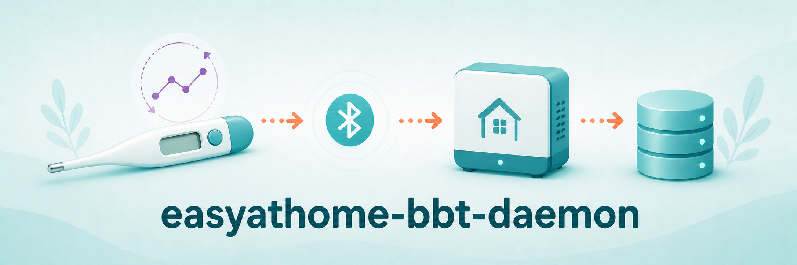

# easyathome-bbt-daemon



  

[](https://github.com/home-health-hub/easyathome-bbt-daemon/blob/main/LICENSE) [](https://github.com/home-health-hub/easyathome-bbt-daemon#contributing) [](https://github.com/home-health-hub/easyathome-bbt-daemon/discussions)

A standalone Linux daemon that collects readings from an Easy@Home EBT-300
basal body temperature (BBT) thermometer over Bluetooth Low Energy (BLE) and
stores them locally, as part of [Health Hub](https://github.com/home-health-hub)
-- a personal/household health-data appliance made of independent device
daemons plus a coordinating Hub. This daemon owns its own SQLite data and
exposes a versioned REST API; the Hub never touches its database directly.
See [docs/HEALTH_HUB_BBT_DAEMON_ADDENDUM.md](docs/HEALTH_HUB_BBT_DAEMON_ADDENDUM.md)
for the full architectural design this daemon implements against.

It's a thin wrapper around the
[`easyathome-ble`](https://github.com/chmielowiec/easyathome-ble) library.

> [!WARNING]
> **Not yet tested against real hardware.** No EBT-300 device was available
> during development. Every part of this daemon that talks BLE (`collector.py`)
> was written strictly from `easyathome-ble`'s published source and README,
> never run against a physical thermometer, and could be wrong in ways unit
> tests can't catch. Treat it as logically-correct-on-paper until that's
> changed. See [CLAUDE.md](CLAUDE.md) for the reasoning behind specific
> design choices made under that uncertainty. This notice will be removed
> once confirmed.

> [!WARNING]
> **The underlying `easyathome-ble` library is alpha-stage and single-model.**
> Its own maintainer documents it as supporting exactly one device
> (EBT-300) with reconnect behavior, duplicate delivery, and timestamp
> semantics unverified against hardware -- see
> [chmielowiec/easyathome-ble](https://github.com/chmielowiec/easyathome-ble).
> This daemon's dedup and time-resolution logic (`storage.py`) is designed
> to be safe under several plausible failure modes (duplicate historical
> redelivery, naive/ambiguous timestamps, a device clock that drifts), but
> that design has only been exercised with synthetic data, not the real
> protocol.

**Disclaimer: This is an unofficial, independently developed project. It is
not affiliated with, officially maintained by, or in any way officially
connected with Easy@Home or any thermometer manufacturer. Nothing here is
medical advice. Basal body temperature charting is not a reliable
standalone method of pregnancy prevention or detection; talk to a doctor or
qualified fertility-awareness instructor about interpreting your own
readings.**

## Current scope

This release is **collection and persistence only**. It receives BLE
readings from the EBT-300, resolves their timestamps, deduplicates them,
and stores them durably with a full correction/exclusion audit trail. It
also provides the schema and CRUD functions for the daily BBT
context-entry fields (cycle day, mucus, disturbances, notes, etc.).

**Not implemented yet** (tracked as follow-up phases -- see
[docs/HEALTH_HUB_BBT_DAEMON_ADDENDUM.md](docs/HEALTH_HUB_BBT_DAEMON_ADDENDUM.md)
for the full design of each):

- The BBT context-entry web form/UI (schema and CRUD functions exist;
  there is no HTTP endpoint or UI for them yet).
- Dashboards and charts.
- PDF reporting.
- All three interpretation engines: chart-only rendering, Sensiplan,
  SymptoPro, and Taking Charge of Your Fertility (TCOYF). Raw observations
  are stored method-neutral; nothing in this release calculates a
  coverline, a temperature shift, or a fertile window.

`GET /api/v1/capabilities` reports this honestly at runtime (see
[HTTP API](#http-api) below).

## Supported devices

Exactly one: the Easy@Home EBT-300, via
[`easyathome-ble`](https://github.com/chmielowiec/easyathome-ble). No other
device is supported or planned against this library.

## Installation

Requires Python 3.11+.

### Quick install

```bash
git clone https://github.com/home-health-hub/easyathome-bbt-daemon.git
cd easyathome-bbt-daemon
sudo ./install.sh
```

This creates a venv at `/opt/easyathome-bbt-daemon`, installs the package
from the checkout, seeds `/etc/easyathome-bbt-daemon/config.ini` (if it
doesn't already exist), creates an `easyathome-bbt-daemon` system user, and
installs the systemd units (the collection daemon; the HTTP API service is
installed but not enabled, since it's opt-in). It's safe to re-run: it
skips steps that are already done. Edit the config and
`sudo systemctl restart easyathome-bbt-daemon` afterward.

`config.ini` can hold a real API token, so `install.sh` sets it to mode
`600`, owned by the `easyathome-bbt-daemon` user, every time it runs
(including on re-runs, in case it was ever loosened). Running the CLI by
hand afterward needs `sudo -u easyathome-bbt-daemon`, e.g.:

```bash
sudo -u easyathome-bbt-daemon easyathome-bbt-daemon --config /etc/easyathome-bbt-daemon/config.ini --check-config
```

### Manual install

```bash
python3 -m venv /opt/easyathome-bbt-daemon/venv
/opt/easyathome-bbt-daemon/venv/bin/pip install /path/to/easyathome-bbt-daemon  # this checkout
```

#### Config file

```bash
sudo mkdir -p /etc/easyathome-bbt-daemon
sudo cp config/easyathome-bbt-daemon.ini.example /etc/easyathome-bbt-daemon/config.ini
sudo "$EDITOR" /etc/easyathome-bbt-daemon/config.ini
```

`daemon.address` and `daemon.device_timezone` are both required.
`easyathome-ble` exposes no device-discovery helper of its own, so unlike
some sibling daemons this one cannot auto-discover the EBT-300 -- find its
BLE address by hand (e.g. via `bluetoothctl` or nRF Connect) first. See
[config/easyathome-bbt-daemon.ini.example](config/easyathome-bbt-daemon.ini.example)
for every setting, with inline documentation.

Validate a config file without starting the daemon:

```bash
easyathome-bbt-daemon --config /etc/easyathome-bbt-daemon/config.ini --check-config
```

#### systemd service

```bash
sudo cp systemd/easyathome-bbt-daemon.service /etc/systemd/system/
sudo systemctl daemon-reload
sudo systemctl enable --now easyathome-bbt-daemon
journalctl -u easyathome-bbt-daemon -f
```

### HTTP API

Optional and not enabled by default. `easyathome-bbt-api` runs a small
unauthenticated HTTP server exposing liveness and capability discovery
only -- no reading data yet (see [Current scope](#current-scope)).

```ini
[api]
enabled = yes
host = 127.0.0.1
port = 8081
token =
```

```bash
sudo cp systemd/easyathome-bbt-api.service /etc/systemd/system/
sudo systemctl daemon-reload
sudo systemctl enable --now easyathome-bbt-api
```

Endpoints, versioned under `/api/v1/`:

| Method & path | Description |
|---|---|
| `GET /api/v1/health` | Unauthenticated liveness check: `{"status": "ok", "version": "..."}`. |
| `GET /api/v1/capabilities` | Unauthenticated description of what this daemon supports -- see [Current scope](#current-scope). |

```bash
curl http://127.0.0.1:8081/api/v1/capabilities
```

**There's no TLS built in.** `host` defaults to `127.0.0.1` (loopback only)
for a reason: don't bind it to `0.0.0.0` or a LAN-facing interface without
putting a reverse proxy (with TLS and its own auth) in front of it. If
`api.host` isn't a loopback address and `api.token` is blank, `easyathome-bbt-api`
prints a warning at startup -- it's not blocked outright, since a reverse
proxy handling auth in front is a legitimate setup, but neither endpoint in
this release requires the token regardless (there's no sensitive data to
protect yet); it's validated now so the setting is ready once a later
phase adds endpoints that need it.

## Manual usage

### On-demand capture instead of a long-running service

```bash
easyathome-bbt-daemon --config /etc/easyathome-bbt-daemon/config.ini --once --once-timeout 30
```

Connects once, stays connected for `--once-timeout` seconds collecting
whatever notifications arrive (a live reading, and/or a batch of
historical readings the device may flush on connect), then disconnects and
exits. Exit code is `1` if nothing was received in that window.

## Database schema

See [storage.py](src/easyathome_bbt_daemon/storage.py)'s module docstring
and [CLAUDE.md](CLAUDE.md) for the full schema and the reasoning behind
its time-field and audit-history design. In short: `readings` holds one
row per stable, deduplicated observation with `device_taken_at_raw` /
`taken_at` / `received_at` / optional `imported_at` kept distinct;
`reading_corrections`, `reading_time_corrections`, `reading_exclusions`,
and `reading_assignments` are append-only audit tables, never
overwritten in place; `context_entries` holds the daily
menstrual/cycle/disturbance fields from the addendum (schema and CRUD
only in this release -- no form UI yet).

## Acknowledgments

- Built on [`easyathome-ble`](https://github.com/chmielowiec/easyathome-ble)
  (MIT license) by Robert Chmielowiec, which implements the EBT-300's BLE
  protocol.
- Project layout modeled on
  [`health-thermometer-daemon`](https://github.com/home-health-hub/health-thermometer-daemon).
- Code review, implementation, and documentation assisted by
  [Claude](https://www.anthropic.com/claude).

## Contributing

Contributions are welcome!

- **Bug reports**: [Open an issue](https://github.com/home-health-hub/easyathome-bbt-daemon/issues).
- **Everything else** (questions, feature requests, ideas, general discussion): [Use Discussions](https://github.com/home-health-hub/easyathome-bbt-daemon/discussions).
- Pull requests are welcome for bug fixes or discussed features.

## License

This project is licensed under the **GNU General Public License v3.0**.

See [LICENSE](LICENSE) for more information.
